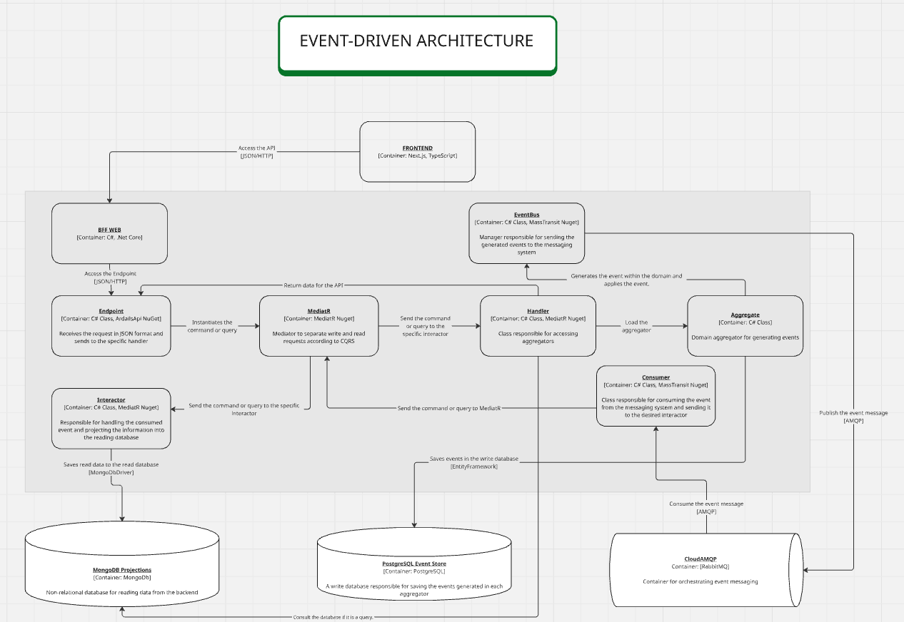

# OKR Driven — Backend

API backend da plataforma **OKR Driven**, construída como um **Monólito Modular orientado a eventos** com **DDD**, **CQRS** e **Event Sourcing**.

---

## Stack

| Categoria | Tecnologia |
|---|---|
| Runtime | .NET 8 / ASP.NET Core |
| Event Store | PostgreSQL + EF Core (Npgsql) |
| Read Models | MongoDB |
| Message Broker | RabbitMQ via MassTransit |
| Agendamento de Jobs | Hangfire |
| Autenticação | JWT + bcrypt |
| Email | Brevo (SMTP relay) |
| Logging | Serilog |
| Monitoramento | New Relic |
| Qualidade de Código | SonarQube |
| Containers | Docker |
| Infra como Código | Terraform |

---

## Arquitetura

O backend segue **DDD + CQRS + Event-Driven Architecture** organizado em módulos independentes:

- **Escrita**: comandos processados por handlers que carregam agregados do Event Store (PostgreSQL), invocam comportamento de domínio e persistem eventos imutáveis
- **Leitura**: eventos publicados no RabbitMQ são consumidos por Projection Handlers que atualizam Read Models no MongoDB — otimizados para consultas rápidas de dashboard
- **Assíncrono**: alertas, relatórios e auditoria são processados por handlers independentes via RabbitMQ, sem bloquear o fluxo principal

### Diagrama



### Separação de responsabilidades por camada

```
Domain         → Agregados, Eventos, Enumerações, Projection Models
Shared         → Commands, Email Commands, Response DTOs
Application    → Command Handlers, Validators, Projection Handlers, Job Handlers
Persistence    → DbContext, EF Configurations, MongoDB Projections, Migrations
Infrastructure → Module Installer, Service Installers, Application Services
Web            → Endpoints, Request DTOs, Routes, MassTransit Consumers
```

---

## Estrutura de Módulos

```
src/
├── Core/                              # Infraestrutura cross-cutting compartilhada
│   ├── Core.Domain/                   # Primitives: Entity, AggregateRoot, IDomainEvent
│   ├── Core.Application/              # ApplicationService, ICommandHandler, IEventHandler
│   ├── Core.Persistence/              # EventStore, Projection, MongoDbContext
│   ├── Core.Infrastructure/           # ServiceInstaller base, Scrutor extensions
│   └── Core.Shared/                   # IdentifierResponse, Result, erros base
│
├── Modules/
│   ├── Identity/                      # Autenticação, usuários, convites, perfis
│   │   ├── Identity.Domain/
│   │   ├── Identity.Application/
│   │   ├── Identity.Infrastructure/
│   │   ├── Identity.Persistence/
│   │   └── Identity.Shared/
│   │
│   ├── Organization/                  # Times, departamentos, estrutura organizacional
│   │   ├── Organization.Domain/
│   │   ├── Organization.Application/
│   │   ├── Organization.Infrastructure/
│   │   ├── Organization.Persistence/
│   │   └── Organization.Shared/
│   │
│   ├── OKR/                           # OKRs anuais, trimestrais, Key Results, check-ins
│   │   ├── OKR.Domain/
│   │   ├── OKR.Application/
│   │   ├── OKR.Infrastructure/
│   │   ├── OKR.Persistence/
│   │   └── OKR.Shared/
│   │
│   └── Dashboard/                     # Projeções de dashboard, status de ciclo, relatórios
│       ├── Dashboard.Domain/
│       ├── Dashboard.Application/
│       ├── Dashboard.Infrastructure/
│       ├── Dashboard.Persistence/
│       └── Dashboard.Shared/
│
└── Web/                               # ASP.NET Core host — entry point
    └── Endpoints/
        └── Modules/
            ├── Identity/
            ├── Organization/
            ├── OKR/
            └── Dashboard/
```

### Convenção de módulo

Cada módulo segue a mesma anatomia interna obrigatória:

```
{Module}.Domain/
├── Aggregates/             # AggregateRoot — estado e comportamento de domínio
├── Events/
│   └── DomainEvents.cs     # Todos os eventos do módulo em um único arquivo
├── Enumerations/           # SmartEnum — nunca enum nativo do C#
└── Projections/
    └── ProjectionModel.cs  # Read models para MongoDB

{Module}.Shared/
├── Commands/               # sealed record : ICommand / ICommand<TResponse>
├── Emails/                 # Email delivery commands (primitivos — Hangfire)
└── Response/               # sealed record Response DTOs

{Module}.Application/
├── Services/               # I{Module}ApplicationService (marker interface)
├── DependencyInjection/    # AddEventInteractors() — registro manual de Projection Handlers
└── UseCases/
    ├── Commands/           # ICommandHandler<TCommand>
    ├── Validators/         # AbstractValidator<TCommand>
    ├── Events/             # Projection Handlers — atualizam MongoDB
    ├── Emails/             # Email Handlers — enviados via Hangfire
    └── Jobs/               # Job command + handler no mesmo arquivo

{Module}.Persistence/
├── Context/                # {Module}DbContext + {Module}ProjectionDbContext
├── Configurations/         # StoreEventConfiguration<T> + SnapshotConfiguration<T>
├── Projection/             # I{Module}Projection<T> + {Module}Projection<T>
├── Constants/
│   └── Schemas.cs          # Schema PostgreSQL do módulo
└── Migrations/

{Module}.Infrastructure/
├── {Module}ModuleInstaller.cs            # Entrada do módulo — orquestra todos os installers
├── ServiceInstallers/
│   ├── ApplicationServiceInstaller.cs    # MediatR, FluentValidation, AutoMapper
│   ├── InfrastructureServiceInstaller.cs # IEventBus, opções de configuração
│   └── PersistenceServiceInstaller.cs    # EF Core, MongoDB, open generics
└── Services/
    └── {Module}ApplicationService.cs     # Wrapper vazio — vincula DbContext ao módulo
```

---

## Infraestrutura

| Serviço | Propósito | Porta local |
|---|---|---|
| PostgreSQL | Event Store — escrita transacional e snapshots | 5432 |
| MongoDB | Read Models — projeções otimizadas por módulo | 27017 |
| RabbitMQ | Message Broker — eventos de domínio assíncronos | 5672 |
| Hangfire | Job Scheduler — emails, alertas, tarefas periódicas | — |
| New Relic | APM — monitoramento de performance e rastreamento de erros | — |

Toda a infraestrutura é containerizada via Docker e definida como código via Terraform, garantindo ambientes reproduzíveis em qualquer cloud (AWS, Azure, GCP).

---

## Qualidade e Testes

- Pipeline MediatR com `ValidationPipelineBehavior` e `RequestLoggingPipelineBehavior` em todas as requisições
- Handlers críticos cobertos por testes de unidade e integração
- Análise estática contínua via SonarQube
- Logging estruturado via Serilog

---

## Auditoria

Toda operação gera eventos imutáveis persistidos no PostgreSQL via Event Sourcing. Não há soft-delete — a trilha de eventos é a fonte definitiva de auditoria, preservando decisões, mudanças e resultados sem perda de histórico. Coberto por:

- Criação e edição de OKRs e Key Results
- Check-ins de progresso, comentários e contestações
- Encerramento de ciclo com classificação final
- Ações administrativas de ciclo

---

## Executar o Projeto Localmente

### 1. Subir a infraestrutura

```bash
docker-compose -f Docker/docker-compose.Infrastructure.Development.yaml up -d
```

Os serviços estarão disponíveis em:
- **PostgreSQL:** `localhost:5432`
- **MongoDB:** `localhost:27017`
- **RabbitMQ:** `localhost:5672`

### 2. Configurar credenciais

```bash
cp .env.example .env.local
```

Para desenvolvimento local, os valores padrão já funcionam sem alteração.

### 3. Aplicar migrations

```bash
# Adicionar nova migration
dotnet ef migrations add <MigrationName> \
  --project src/Modules/<Module>/<Module>.Persistence \
  --startup-project src/Web \
  --context <Module>DbContext

# Aplicar migrations ao banco
dotnet ef database update \
  --project src/Modules/<Module>/<Module>.Persistence \
  --startup-project src/Web \
  --context <Module>DbContext

# Contextos disponíveis:
#   Identity     → IdentityDbContext
#   Organization → OrganizationDbContext
#   OKR          → OKRDbContext
#   Dashboard    → DashboardDbContext
```

### 4. Buildar e executar via Docker

```bash
# Build da imagem
docker build --no-cache -t okrdriven-api .

# Executar a API
docker run --rm -p 5258:8080 \
  --network okrdriven-dev \
  --env-file .env.local \
  okrdriven-api
```

- **API:** `http://localhost:5258/api`
- **Swagger:** `http://localhost:5258/api/swagger`

### Executar via .NET CLI

```bash
# Build da solution
dotnet build OKRDriven.sln

# Executar o projeto Web
dotnet run --project src/Web/Web.csproj

# Executar todos os testes
dotnet test OKRDriven.sln
```